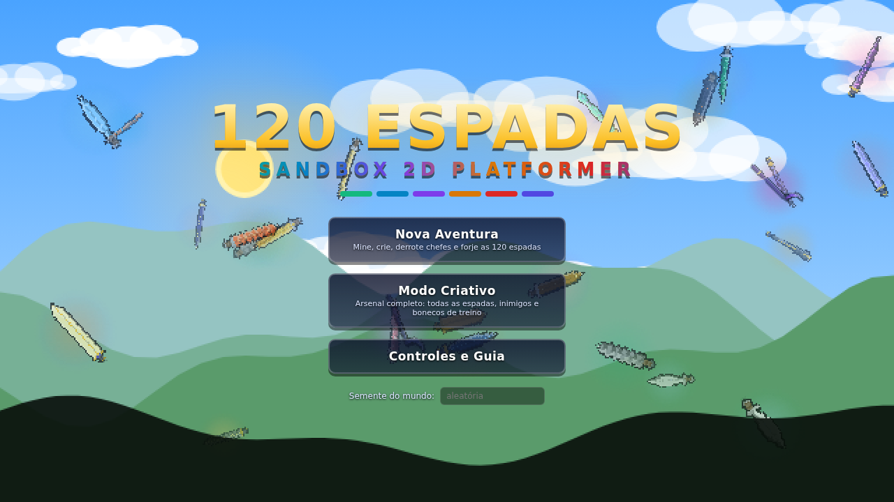
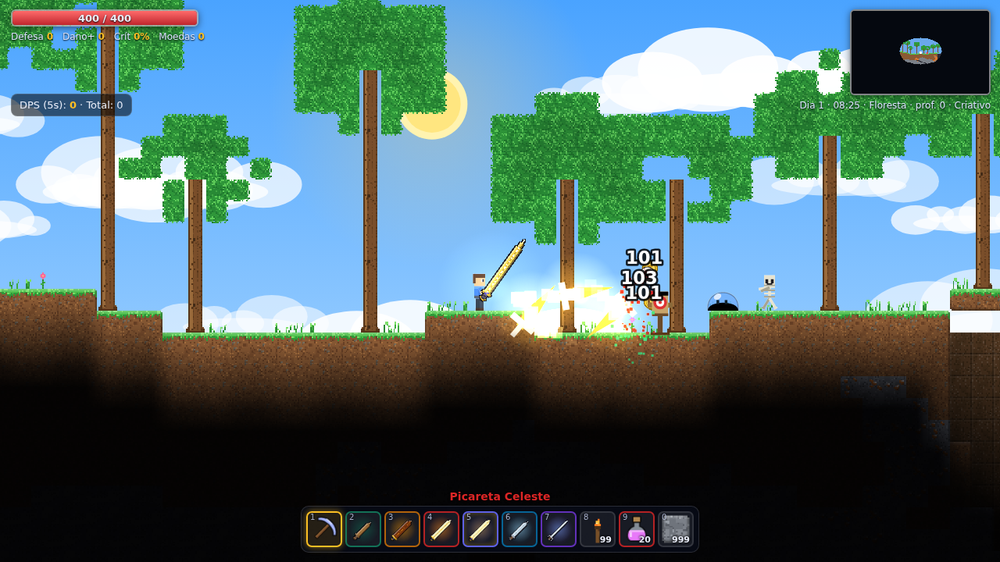
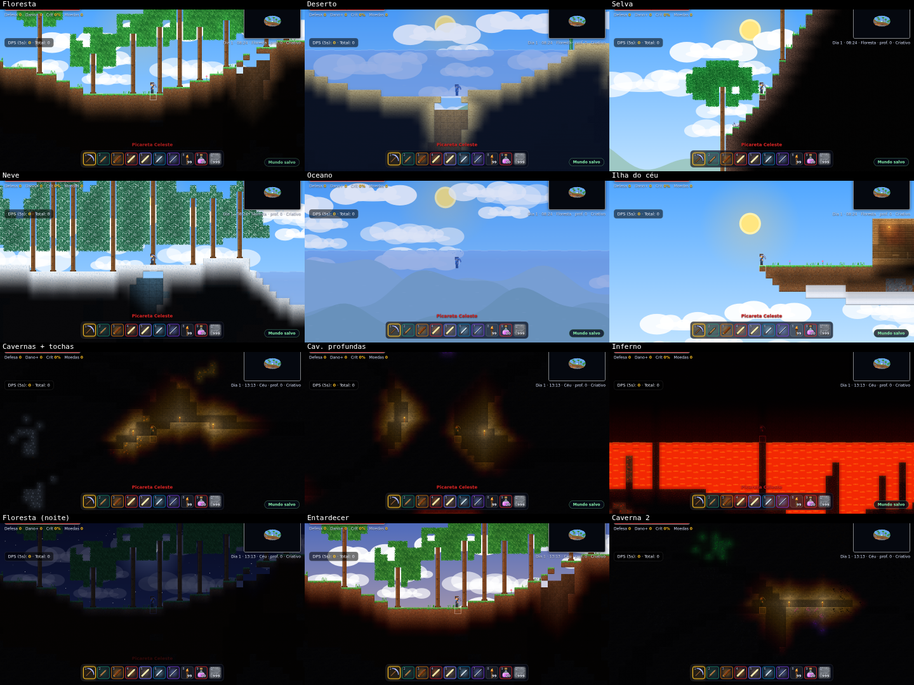
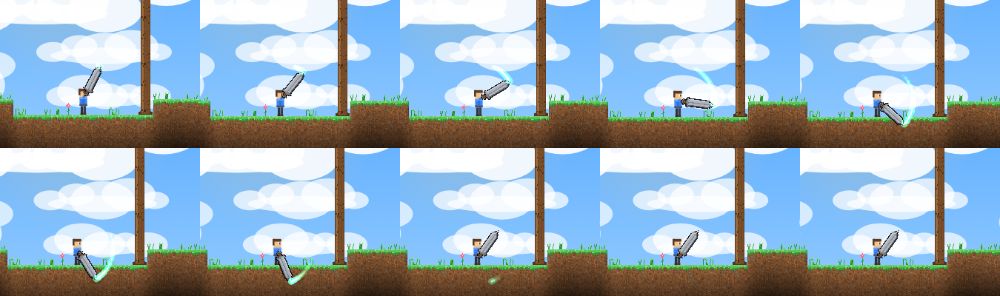
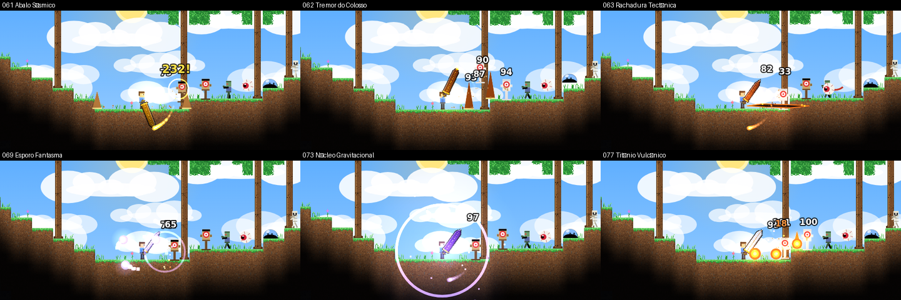
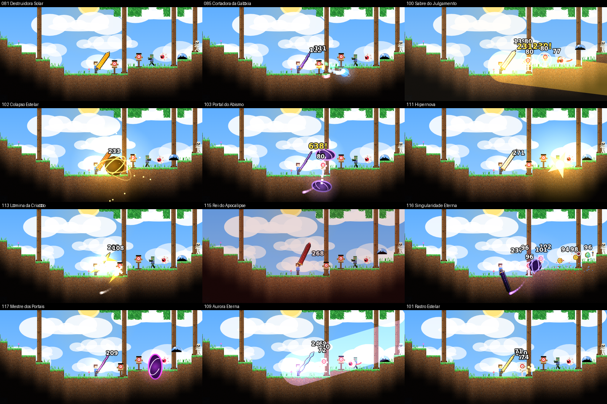
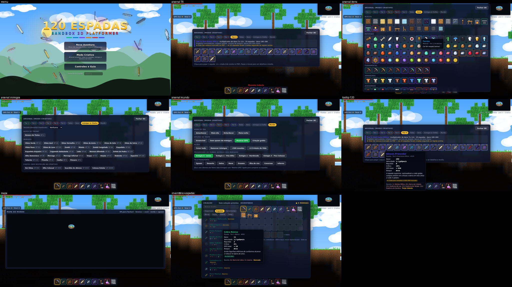
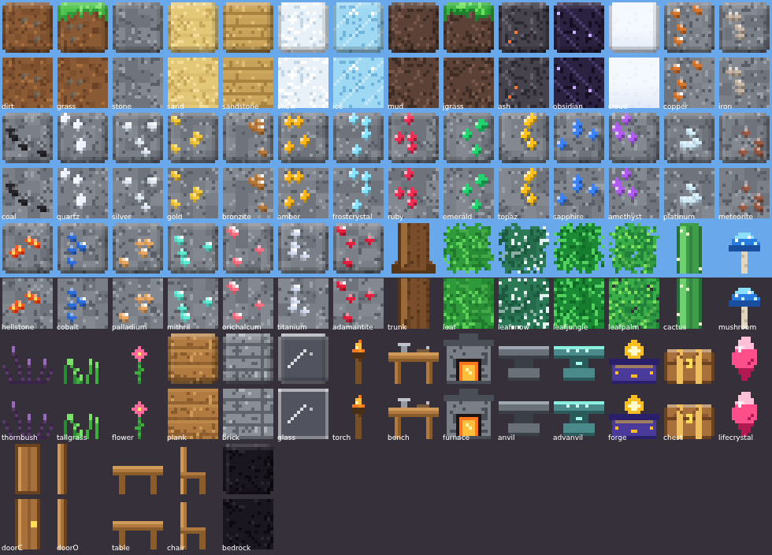
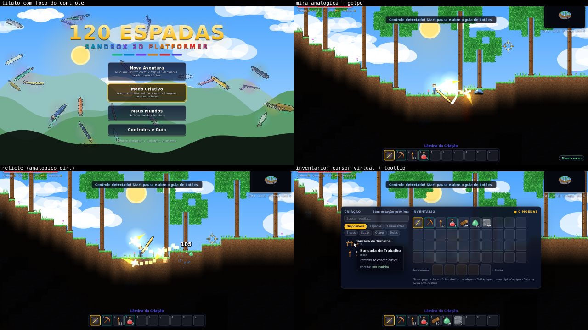

# 120 ESPADAS — Sandbox 2D Platformer

Jogo 2D de exploração, mineração e combate no estilo *Terraria*, com **120 espadas únicas**, implementado a partir do
documento **"GDD & MASTER PROMPT: SANDBOX 2D PLATFORMER"** (PDF enviado).

> **Jogar online:** **https://jk-jhon1.github.io/101spas/** — direto no navegador, sem instalar nada.
>
> **Offline:** abra o arquivo **`index.html`** num navegador moderno (Chrome, Edge, Firefox, Safari). É um único
> arquivo autocontido — sem instalação, sem internet, sem assets externos. Use teclado + mouse, ou um controle (gamepad) com mira analógica.

---

## ⚠️ Sobre o PDF (importante)

O PDF recebido está **truncado**: as tabelas de espadas dos **Tiers 2, 4 e 6** (espadas **021–040, 061–080 e 101–120**)
terminam logo após o cabeçalho, sem nenhuma linha. Só os Tiers **1, 3 e 5** (80 espadas) têm dados.

- As **80 espadas do PDF** foram implementadas com **nome, Dano/Vel/KB e mecânica exatamente como no documento**.
- As **40 espadas faltantes foram criadas** seguindo as regras de cada tier do próprio GDD (faixa de multiplicador de dano,
  cor e tipo de mecânica). Elas aparecem marcadas com **★** no jogo e no catálogo.
  Se você tiver o PDF completo, basta editar as linhas correspondentes em `src/11_swords.js` e rodar `node build.js`.

| Tier | Espadas | Origem | Regra do GDD que guiou as criadas |
|---|---|---|---|
| T1 Básico `#10b981` | 001–020 | PDF | — |
| T2 Pré-Bosses `#0284c7` | 021–040 | ★ criadas | projéteis retos simples, roubo de vida baixo, repulsão massiva, fogo/gelo |
| T3 Mid-Game `#7c3aed` | 041–060 | PDF | — |
| T4 Hardmode Inicial `#d97706` | 061–080 | ★ criadas | ondas de choque no relevo, estalagmites, esporos flutuantes, aura gravitacional |
| T5 Hardmode Avançado `#dc2626` | 081–100 | PDF | — |
| T6 End-Game Mítico `#4f46e5` | 101–120 | ★ criadas | projéteis rastreadores, colapso estelar, portais de ataque, dano em tela cheia |

Catálogo completo (com receitas): [`docs/catalogo_120_espadas.md`](docs/catalogo_120_espadas.md) e `.csv`.

---

## Capturas

| | |
|---|---|
|  |  |
|  |  |
|  |  |
|  |  |
|  | |

---

## Controles

| Tecla / mouse | Ação |
|---|---|
| `A` `D` / `←` `→` | Mover |
| `Espaço` `W` `↑` | Pular · nadar para cima |
| **Botão esquerdo (segurar)** | Atacar (arco de ataque na direção do cursor) · minerar · colocar bloco · usar item |
| Botão direito | Abrir baú · abrir/fechar porta · falar com NPC |
| `1`–`0` / roda do mouse | Selecionar item da barra |
| `E` / `Tab` | Inventário + criação (fique perto de Bancada, Fornalha, Bigorna…) |
| `B` | **Arsenal** (modo Criativo) · **Catálogo das 120 espadas** (modo Aventura) |
| `M` | Mapa do mundo · `Q` poção de cura · `+` `-` zoom · `F3` debug · `Esc` pausar/fechar |

### Jogar online / publicar

- **GitHub Pages (este repositório):** já ativado — o jogo está em `https://jk-jhon1.github.io/101spas/`. Para ativar numa cópia/fork: *Settings → Pages → Build and deployment → Source: Deploy from a branch → Branch `main`, pasta `/ (root)` → Save* (em 1–2 minutos o jogo fica em `https://SEU_USUARIO.github.io/NOME_DO_REPO/`). O `index.html` já está na raiz e o arquivo `.nojekyll` dispensa o processamento do Jekyll.
- **Local:** `node serve.js` (ou `npm run serve`) abre o jogo em `http://localhost:8080/` (servido por http, o salvamento e o controle funcionam em qualquer navegador).
- **Outras hospedagens:** o jogo é um único `index.html`; qualquer hospedagem estática serve — por exemplo **itch.io** (*Kind of project: HTML*, envie um `.zip` com o `index.html` na raiz e marque *"This file will be played in the browser"*) ou **Netlify Drop** (`netlify.com/drop`, arraste a pasta; crie uma conta gratuita para o site não expirar).

### Controle (gamepad) — mira analógica

O GDD manda orientar o arco pelo "cursor do mouse/**analógico**", então o jogo também roda com controle
(layout padrão Xbox/PlayStation; o navegador só enxerga o controle depois do primeiro botão apertado).

| Botão | Ação |
|---|---|
| Analógico esquerdo / direcional ◀ ▶ | Mover |
| `A` | Pular · nadar para cima |
| **Analógico direito** | **Mira analógica**: o arco da espada aponta para onde o analógico aponta; a inclinação define a distância do alvo (ferramentas ficam sempre dentro do alcance de mineração). Uma cruz mostra o alvo |
| `RT` ou `X` (segurar) | Atacar · minerar · colocar bloco · usar item. Sem mira no analógico direito: usa o analógico esquerdo (ex.: ↓ para cavar para baixo) ou o lado para onde o jogador olha |
| `B` | Interagir com o baú / porta / NPC mais próximo (sem precisar mirar) |
| `LB` `RB` | Item anterior / próximo da barra |
| `LT` | Poção de cura rápida |
| `Y` · direcional ▲ · direcional ▼ ou `Select` | Inventário e criação · catálogo/arsenal · mapa |
| `L3` `R3` | Zoom − / + |
| `Start` | Pausar / fechar painéis |
| **Menus** | Direcional ou analógico ▲▼ escolhe, `A` confirma |
| **Painéis** (inventário, criação, catálogo, NPC) | Analógico esquerdo move um cursor virtual · `A` clica · `X` botão direito · `RB` Shift+clique · analógico direito rola a lista · `B` fecha |

Mouse e controle podem se alternar: mexer o mouse devolve a mira a ele. Dentro de um `<iframe>` sem `allow="gamepad"`
o navegador bloqueia a API (o jogo detecta isso e simplesmente ignora o controle) — abra o `index.html` direto no navegador.

**Modo Aventura:** comece com a espada 001 e uma picareta de cobre; minere, crie, derrote chefes e forje as 120 espadas.
**Modo Criativo:** Arsenal com todas as espadas/itens, Boneco de Treino com medidor de DPS, invocação de qualquer
inimigo/chefe (inclusive variantes elementais), controle de hora, teleporte, estágio do mundo, invencibilidade etc.

### Progressão
1. **Tier 1** — madeira, cobre, ferro → Bancada → Fornalha → Bigorna. Picareta ganha poder para novos minérios.
2. **Tier 2** — platina, meteorito (ilhas do céu e crateras), Brasita do Inferno, gemas, presas, ferrões. Chefes: **Rei Slime**, **Olho Colossal** (à noite).
3. **Tier 3/4 (Hardmode)** — **Guardião do Abismo** (invocado no Inferno com o Boneco Infernal) inicia o Hardmode: surgem
   Cobalto/Paládio/Mithril/Orichalcum/Titânio/Adamantita; inimigos elementais dropam **Essências**. Bigorna Avançada (Mithril/Orichalcum).
4. **Tier 5/6** — Fragmentos Celestes → Forja Celeste. **Colosso Estelar** (chefe final) dropa o **Núcleo Mítico** para o Tier 6.

Estações: Bancada → Fornalha → Bigorna → Bigorna Avançada → Forja Celeste. NPCs (Guia, Mercador, Enfermeira, Armeiro) moram em
casas válidas (sala fechada com paredes de fundo, luz, mesa/bancada, cadeira e porta).

---

## Mapeamento GDD → implementação

| Seção do GDD | Onde / como foi feito |
|---|---|
| Grid de tiles **16×16**, blocos destrutíveis/colocáveis | `TS = 16`; camadas `Uint8Array` de tile/parede/líquido (`02_world.js`, `12_player.js`) |
| Mundo procedural **assíncrono** | `genWorld()` é um *generator* (`03_worldgen.js`) consumido em fatias de ~14 ms por frame, com barra de progresso. 1400×480 tiles (~0,8 s); biomas horizontais (oceano/deserto/floresta/selva/neve) + camadas verticais (céu, superfície, cavernas, profundas, Inferno) |
| **Iluminação dinâmica** por propagação de opacidade | `04_light.js`: luz RGB por célula, decaimento pela opacidade do tile de origem, 2×4 varreduras, fontes dinâmicas (projéteis, tochas, lava), ciclo dia/noite. Composição multiplicativa preservando o céu (`16_main.js`) |
| **Simulação de fluidos / gravidade** | Autômato celular de água e lava (lava+água = obsidiana), areia com gravidade, plantas e objetos sem apoio quebram (`02_world.js`) |
| Pilares: biomas verticais · minérios progressivos · crafting encadeado · abrigo/NPCs · combate rápido com curva de poder | Camadas do mundo; picaretas de poder 1–9 × dureza dos minérios; 5 estações; `15b_npc.js`; DPS base médio por tier: **17 → 37 → 62 → 88 → 156 → 245** |
| **Melee**: arco θ0→θfinal em torno do ombro, direção (Cursor − Jogador), cursor do **mouse/analógico** | `09b_swing.js`: ombro como pivô, arco de ~143° centrado na mira, sentido alternado a cada golpe; Thrust/Beam usam a mesma direção. Mira por mouse ou por analógico direito (`15d_gamepad.js` converte a inclinação do analógico em um "cursor" no mundo) |
| **Knockback** `F = normalize(Alvo−Jogador) × KB` com amortecimento por massa | `hitEnemy()` em `09_combat.js` (`F = KB·58 / (0,5+0,5·massa) · (1−resistência)`) |
| **I-frames independentes** (jogador × inimigos) | Jogador: `P.inv_` dinâmico (0,55–1,1 s conforme o dano). Inimigos: imunidade **por fonte** (cada golpe/projétil guarda sua janela) — evita hits duplicados em colisões sobrepostas |
| `DanoFinal = (DanoBase + ModAcessórios) × (1+CritMult) × ModResistência` | `hitEnemy()`: acessórios somam dano plano; crítico `×(1+CritMult)`; resistência `60/(60+defesa)` |
| Projéteis herdam **100% da direção do arco no ápice** | `shoot()` em `10_fx.js` dispara em `inst.aim` a partir de `inst.tip` no meio do arco |
| **Inventário**: slots, IDs únicos, stack ≤ 999, metadados de raridade | 40 slots + 4 de equipamento; `STACK_MAX = 999`; `item.tier` define cor de borda/nome/tooltip (`TIERS` em `01_data.js`) |
| **Tiers e cores** (T6 índigo/dourado) | `TIERS`: `#10b981 #0284c7 #7c3aed #d97706 #dc2626 #4f46e5` + brilho dourado no T6 |
| **Schema `SwordItemSO`** | `11_swords.js`: `swordID, swordName, tierLevel, baseDamage, attackSpeed, knockbackForce, critChance, projectilePrefab, attackType (ArcSwing/Thrust/Orbital/Beam), passiveEffects[]`, métodos `OnSwing(combat, dir)` e `OnHitEnemy(enemy, info)` |
| **Comportamentos de projétil**: Ballistic, Linear perfurante, Homing, Static/Área | `spawnProj()` (`09_combat.js`): `ballistic` (gravidade), `linear` (`pierce = X`), `homing` (`Vnew = Vcurr + Lerp(Alvo−Pos, steer)`), `static` + `custom` (órbita, onda de chão, feixe, buraco negro…) |
| **Catálogo de 120 espadas** | `11_swords.js` + biblioteca de efeitos reutilizáveis `10_fx.js` (hooks `swing/onSwing/onApex/mod/onHit/onKill/tick/atkMult/stats`) |

### Interpretações assumidas (onde o GDD é ambíguo)
- **Ápice** = metade do arco, quando a lâmina aponta para o cursor; é aí que saem os projéteis e efeitos.
- **005 Vidro Vulcânico**: 5% de chance de quebrar a cada acerto (devolve metade dos materiais; nunca quebra no Criativo).
- **056 Sacrifício**: nunca reduz a vida abaixo de 1 HP. **086 Tempo Congelado**: tem 35% de crítico para o efeito ser viável.
- **096 Quantum**: "costas" = o inimigo olha para o lado oposto ao jogador (os inimigos terrestres demoram ~0,4 s para virar).
- **055 Fóton**: golpes contínuos sem recuperação (a duração do arco ocupa todo o ciclo).

---

## Estrutura do projeto

```
index.html            ← JOGO (arquivo único gerado; é o que você abre)
build.js              ← concatena src/ em index.html:  node build.js
serve.js              ← servidor local (node serve.js → http://localhost:8080/)
package.json          ← scripts npm; única dependência: Playwright (só para os testes de navegador)
src/
  00_util.js            matemática, RNG, ruído Perlin, cores
  01_data.js            TIERS, tiles, paredes, itens, receitas
  02_world.js           mundo, fluidos, areia, apoio de objetos
  03_worldgen.js        geração procedural assíncrona (generator)
  04_light.js           iluminação por propagação de opacidade, céu
  05_gfx.js / 06_icons  sprites 16×16 procedurais, ícones, sprites das espadas
  07_sky.js             céu, sol/lua, estrelas, nuvens, colinas
  08_phys.js            física AABB, partículas, drops · 08b_audio.js: SFX (WebAudio)
  09_combat.js          dano, status, projéteis, explosões, feixes
  09b_swing.js          arco de ataque, ápice, colisão da lâmina
  10_fx.js              biblioteca de efeitos de espadas
  11_swords.js          as 120 espadas (schema SwordItemSO)
  12_player.js          jogador, inventário, crafting, mineração, blocos
  13_enemies.js         inimigos, IA, spawn, drops · 13b_bosses.js: 4 chefes
  14_draw_enemies.js    sprites de inimigos e chefes
  15_ui.js / 15b_npc.js / 15c_save.js   HUD, inventário, arsenal, NPCs, salvar/carregar
  15d_gamepad.js        suporte a controle: mira analógica, menus, cursor virtual nos painéis
  16_main.js            loop, câmera, renderização em camadas, input
docs/                 catálogo das 120 espadas (md/csv) e capturas de tela (img/)
dev/                  scripts de teste (Node + Playwright)
```

### Portar para Unity / Godot
A arquitetura segue o GDD e foi escrita para ser portada. O schema JS equivale a um `ScriptableObject`:

```csharp
[CreateAssetMenu] public class SwordItemSO : ScriptableObject {
  public int swordID; public string swordName; [Range(1,6)] public int tierLevel;
  public float baseDamage, attackSpeed, knockbackForce, critChance;
  public GameObject projectilePrefab; public AttackType attackType;   // ArcSwing, Thrust, Orbital, Beam
  public List<PassiveEffect> passiveEffects;
  public virtual void OnSwing(CombatController c, Vector2 dir) { foreach (var e in passiveEffects) e.OnSwing(c, dir); }
  public virtual void OnHitEnemy(Enemy e, HitInfo i)          { foreach (var p in passiveEffects) p.OnHit(e, i); }
}
```
Os hooks de `10_fx.js` (`swing`, `onApex`, `mod`, `onHit`, `onKill`, `tick`) correspondem 1:1 a métodos virtuais de `PassiveEffect`.
Os dados (tiles, itens, receitas, 120 espadas) estão em tabelas simples, fáceis de exportar para JSON/CSV (`docs/*.csv`).

---

## Testes realizados (automatizados, Chromium headless)
> **Como rodar:** `node dev/validate.js` (catálogo; também regenera `docs/catalogo_*`), `node dev/reach.js` e `node dev/seeds.js` precisam só do Node (`npm test` roda os três). Os testes de navegador usam Playwright: `npm install && npx playwright install chromium`, depois `node dev/test_swords.js` etc. (`npm run test:browser` roda os cinco com veredito: controle, arsenal, inimigos, soak e espadas). `node dev/http_check.js [url]` confere uma URL do jogo (local ou publicada) de ponta a ponta: carrega, salva, recarrega e continua. Os scripts localizam o `index.html` pelo próprio caminho e dividem utilitários em `dev/lib.js`; capturas temporárias vão para `dev/*.png` (ignoradas pelo git). Depois de editar `src/`, recompile com `node build.js`.

- **Catálogo**: 120 espadas, 20 por tier, faixas de dano por tier, receitas válidas (`node dev/validate.js`).
- **Progressão**: todo item é obtível e as 120 espadas são craftáveis a partir de fontes reais do mundo (`node dev/reach.js`); gerador testado em 8 sementes (`node dev/seeds.js`).
- **120 espadas em combate** (`dev/test_swords.js`): cada uma ataca bonecos/inimigos por ~4,5 s — sem exceções, todas causam dano, status esperados observados (sangramento, veneno, gelo, atordoamento, tempo parado, podridão, pânico, cegueira…).
- **Todos os inimigos, variantes elementais e os 4 chefes** (`dev/test_enemies.js`) e **~45.000 passos** de simulação com spawn natural em 14 cenários, todas as camadas e estágios (`dev/soak.js`): zero erros.
- Entrada real de teclado/mouse, crafting pela interface, NPC/moradia, salvar/carregar, fluidos/areia, capturas de tela de biomas e de efeitos.
- **Controle** (`dev/test_gamepad.js`, gamepad simulado, 70 verificações): menus, andar/pular, ângulo real do arco para ↑ → ← ↖ ↘, distância pela inclinação, acerto de inimigo só na direção da mira, minerar/colocar bloco, interagir, cursor virtual (hover, clique, craft, comprar do NPC), pausa/guia, volta do mouse e API bloqueada.

## Limitações conhecidas
- Sem música (apenas efeitos sonoros sintetizados); sem multiplayer. O suporte a controle foi validado com gamepad simulado (não com hardware real); o som só liga após o primeiro clique/tecla/botão, regra dos navegadores.
- Mundo de tamanho fixo (1400×480). Um único slot de save em `localStorage` (não funciona dentro de iframes *sandbox*; abra o HTML direto no navegador).
- Balanceamento de chefes/drops validado por simulação, mas não por playtest humano extenso — ajuste os números em `13_enemies.js` / `11_swords.js` se quiser.
- As 40 espadas ★ são interpretações minhas do GDD; trocar pelas originais é simples (ver acima).
