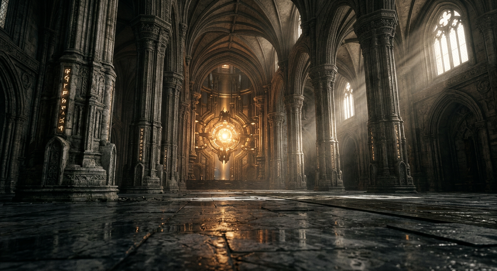

# 101spas

Repositório de projetos e experimentos interativos.

---

## 🏛️ UE5 PBR Sanctuary — Ambiente 3D Fotorrealista de Nova Geração

Um ambiente 3D cinematográfico e fotorrealista em tempo real inspirado nos padrões de renderização da **Unreal Engine 5** (Lumen, Nanite e texturização PBR física).



### 🚀 Destaques Técnicos

1. **Texturas PBR com Microdesgastes e Imperfeições:**
   - Mapas procedurais de alta fidelidade: Albedo com veios e umidade, Sobel Normal Maps para relevos e fendas de argamassa, Roughness com microrriscos e poças d'água reflexivas, Metalness em bronzes envelhecidos e Ambient Occlusion cavitária.
2. **Iluminação Global Dinâmica (Lumen GI) & Ray Tracing:**
   - Luz solar direta com sombras suaves (PCF Soft Shadows) e cálculo dinâmico de saltos de iluminação indireta (*indirect bounce*) com sangramento de cor âmbar no piso e pilares.
   - Núcleo rúnico central de energia radiante com pulsação em tempo real.
3. **Oclusão de Ambiente Profunda (GTAO):**
   - Ground Truth Ambient Occlusion de precisão física eliminando halos e aprofundando o contato nas fendas.
4. **Reflexos em Tempo Real & Dispersão Atmosférica:**
   - Sonda de reflexão dinâmica para reflexos sobre o piso molhado.
   - Feixes de luz volumétricos (*God Rays*) cortando as janelas clerestórias góticas.
   - Mais de 3.500 partículas de poeira (*dust motes*) com iluminação reativa e dispersão frontal (*forward scattering*).
5. **Óptica Cinematográfica & Bokeh DOF:**
   - Profundidade de campo com desfoque óptico natural (*BokehPass*) e foco dinâmico em primeiro e segundo plano.
   - Tone Mapping ACES Filmic com graduação de cores cinematográfica e granulação 35mm.

### 🎮 Como Executar

```bash
cd ue5-pbr-environment
npm install
npm run dev
```
